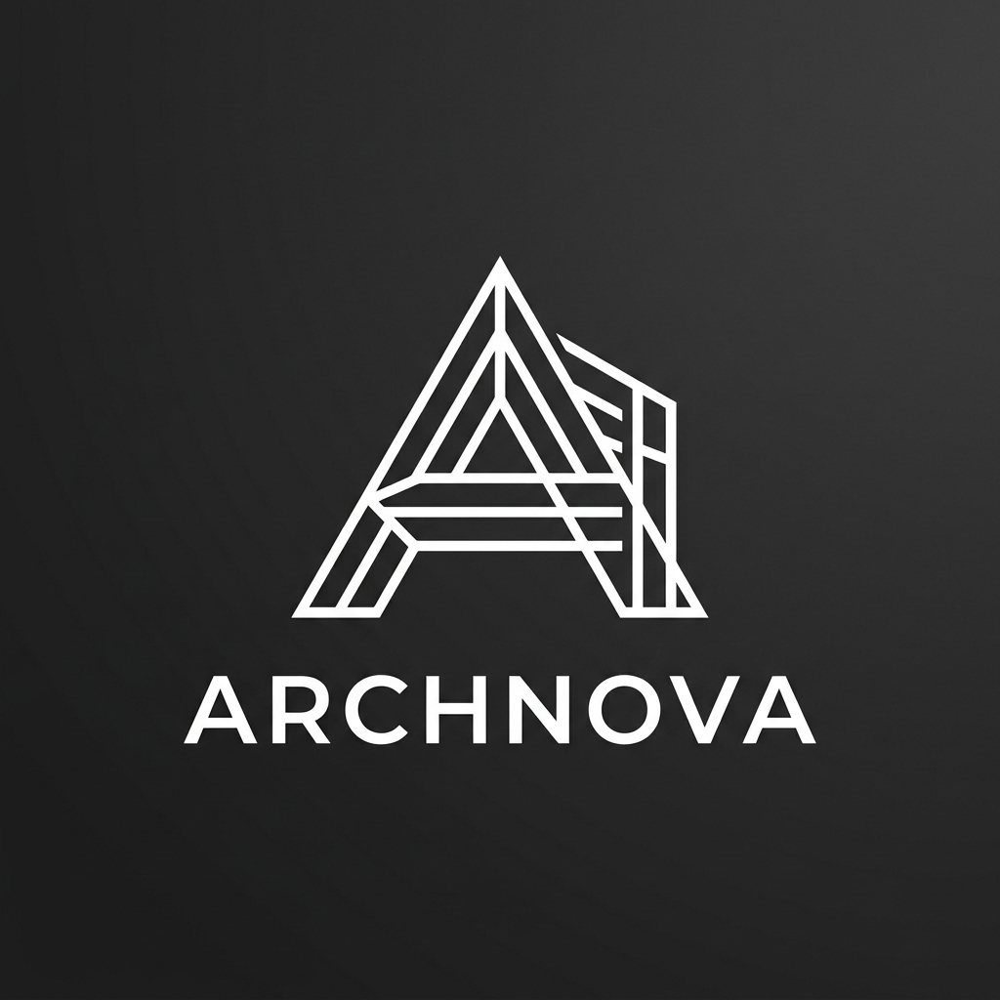

# 🏢 Archnova Studio

> An AI-powered Architecture Operating System and Client Portal.

**[🚀 View Live Production App (Vercel)](https://archnova.vercel.app)**



## Overview
Archnova Studio is a premium, end-to-end web application built for modern architectural firms. It acts as both a beautifully designed landing page for prospective clients and a highly interactive, authenticated operating system for firm members to manage their projects, schedules, and team operations.

## ❓ Why We Built Archnova (The Use Case)
The architecture industry relies heavily on visuals, precision, and client trust. However, most firms struggle with scattered toolsets—using one generic software for their public portfolio, another for project management, and a third for scheduling client meetings. 

**Archnova solves this by unifying the workflow:**
1. **For Clients (The Public Face):** A sleek, high-end portfolio website that instantly builds trust and showcases architectural expertise through a premium, glassmorphic aesthetic.
2. **For Architects (The Internal OS):** A powerful, data-rich dashboard hidden behind a secure login. Architects can track project budgets, schedule site visits (with integrated Google Maps), and host virtual consultations (via Google Meet) all from one centralized hub.

## ✨ Features

- **Immersive Landing Page**: Built with dynamic scroll animations, glassmorphic UI, and adaptive themes to provide a high-end editorial feel.
- **Client Portal (Dashboard)**: A full-fledged internal dashboard designed with highly responsive grids and deep aesthetics.
- **Dynamic Project Management**: Create, edit, and track architectural projects in real-time. Project state is globally managed and persisted.
- **Interactive Site Maps**: Built-in Google Maps iframe integration that automatically plots real-world locations based on project addresses.
- **Google Meet Integration**: Synchronized virtual meetings featuring instantly launchable Google Meet links.
- **Global Theme Engine**: Complete Light/Dark mode support via `next-themes`, ensuring the UI adapts gracefully to system preferences.
- **Flawless Responsiveness**: Every single page is meticulously audited with Tailwind breakpoints to look perfect on mobile devices, tablets, and ultra-wide desktop monitors.

## 💻 Tech Stack

- **Framework**: [Next.js](https://nextjs.org/) (App Router, v16.2.9)
- **Styling**: [Tailwind CSS v4](https://tailwindcss.com/)
- **State Management**: [Zustand](https://zustand-demo.pmnd.rs/) (Persisted)
- **Components**: [Radix UI](https://www.radix-ui.com/) (Primitives) & [Shadcn UI](https://ui.shadcn.com/)
- **Icons**: [Lucide React](https://lucide.dev/)
- **Deployment**: [Vercel](https://vercel.com/)

## 🚀 Getting Started

First, install the dependencies:
```bash
npm install
```

Then, run the development server:
```bash
npm run dev
```

Open [http://localhost:3000](http://localhost:3000) with your browser to see the result. The application supports Hot Module Replacement (HMR) for seamless development.

## ☁️ Deployment

This project is configured to deploy instantly on Vercel with zero additional configuration. 

```bash
# Ensure you have the Vercel CLI installed
npm i -g vercel

# Deploy to production
npx vercel --prod
```

## 🔒 Type Safety & Quality
Archnova Studio enforces strict engineering standards:
- **Zero-Error Policy**: Tested to ensure absolute zero compilation or linting errors.
- **Strict TypeScript**: 100% type-safe codebase.
- **Hydration Safe**: Wrapped with `suppressHydrationWarning` and designed to flawlessly render on the server before transferring to the client.
